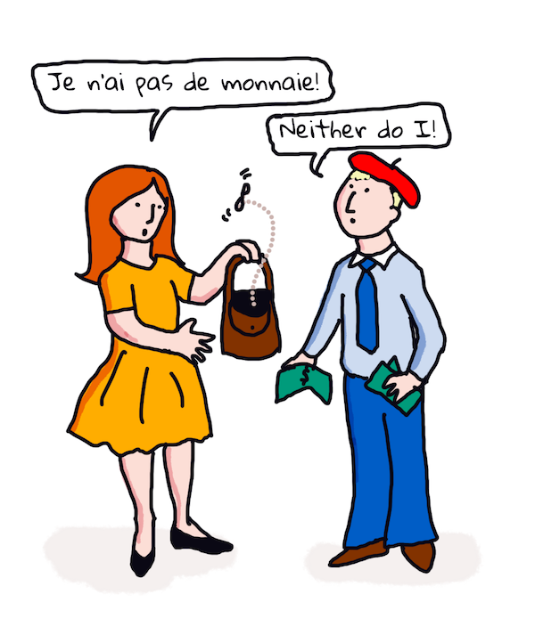

好的，这是您要求的完整、准确、保留 Markdown 格式的中文翻译。

# 使用机器学习进行翻译和情感分析

在之前的课程中，你学习了如何使用 `TextBlob` 构建一个基本的机器人，`TextBlob` 是一个在幕后嵌入了机器学习以执行基本自然语言处理（NLP）任务（如名词短语提取）的库。计算语言学中的另一个重要挑战是将一门口头或书面语言的句子准确地*翻译*成另一种语言。

## [课前测验](https://gray-sand-07a10f403.1.azurestaticapps.net/quiz/35/)

翻译是一个非常困难的问题，因为有数千种语言，而且每种语言的语法规则可能大相径庭，这使得问题更加复杂。一种方法是将一种语言（如英语）的形式语法规则转换为一种与语言无关的结构，然后通过转换回另一种语言来进行翻译。这种方法意味着你需要采取以下步骤：

1.  **识别**。将输入语言中的单词识别或标记为名词、动词等。
2.  **创建翻译**。以目标语言的格式生成每个单词的直接翻译。

### 示例句子，从英语到爱尔兰语

在“英语”中，句子_I feel happy_（我感到快乐）由三个词组成，顺序如下：

-   **主语** (I)
-   **动词** (feel)
-   **形容词** (happy)

然而，在“爱尔兰语”中，同一个句子有着非常不同的语法结构——像“*happy*”（快乐）或“*sad*”（悲伤）这样的情感被表达为*在你身上*。

英语短语 `I feel happy` 在爱尔兰语中是 `Tá athas orm`。*字面*翻译是 `Happy is upon me`（快乐在我身上）。

一个说爱尔兰语的人在翻译成英语时会说 `I feel happy`，而不是 `Happy is upon me`，因为他们理解句子的意思，即使单词和句子结构不同。

这个句子在爱尔兰语中的正式语序是：

-   **动词** (Tá 或 is)
-   **形容词** (athas, 或 happy)
-   **主语** (orm, 或 upon me)

## 翻译

一个简单的翻译程序可能只翻译单词，而忽略了句子结构。

✅ 如果你成年后学习了第二（或第三甚至更多）语言，你可能一开始会用母语思考，在脑海中将一个概念逐字翻译成第二语言，然后再说出你的翻译。这与简单的计算机翻译程序所做的事情类似。要达到流利，克服这个阶段非常重要！

简单的翻译会导致糟糕（有时甚至是滑稽）的错误翻译：`I feel happy` 在爱尔兰语中字面翻译为 `Mise bhraitheann athas`。这（字面意思）是 `me feel happy`，并不是一个有效的爱尔兰语句子。尽管英语和爱尔兰语是在两个邻近岛屿上使用的语言，但它们是非常不同的语言，拥有不同的语法结构。

> 你可以观看一些关于爱尔兰语言传统的视频，比如[这一个](https://www.youtube.com/watch?v=mRIaLSdRMMs)。

### 机器学习方法

到目前为止，你已经了解了自然语言处理的形式规则方法。另一种方法是忽略单词的含义，*转而使用机器学习来检测模式*。如果你有大量的文本（一个*语料库*）或多种文本（*语料库*），并且这些文本同时包含源语言和目标语言，那么这种方法在翻译中可以奏效。

例如，考虑一下《傲慢与偏见》的情况，这是简·奥斯汀在1813年写的一部著名的英文小说。如果你查阅这本书的英文版和该书的*法文*人工翻译版，你可以在一种语言中检测到被*地道地*翻译成另一种语言的短语。你马上就会这么做。

例如，当一个英语短语如 `I have no money` 被字面翻译成法语时，它可能会变成 `Je n'ai pas de monnaie`。“Monnaie” 是一个棘手的法语“假同源词”，因为 'money' 和 'monnaie' 并非同义词。一个人类可能会做出的更好翻译是 `Je n'ai pas d'argent`，因为它更好地传达了你没有钱的意思（而不是 'monnaie' 所指的“零钱”）。



> 图片由 [Jen Looper](https://twitter.com/jenlooper) 提供

如果一个机器学习模型有足够的人工翻译来构建模型，它可以通过识别在先前由精通两种语言的专家翻译过的文本中的常见模式来提高翻译的准确性。

### 练习 - 翻译

你可以使用 `TextBlob` 来翻译句子。试试《**傲慢与偏见**》著名的第一句话：

```python
from textblob import TextBlob

blob = TextBlob(
    "It is a truth universally acknowledged, that a single man in possession of a good fortune, must be in want of a wife!"
)
print(blob.translate(to="fr"))
```

`TextBlob` 在翻译上做得相当不错：“C'est une vérité universellement reconnue, qu'un homme célibataire en possession d'une bonne fortune doit avoir besoin d'une femme!”。

可以说，TextBlob 的翻译实际上比 V. Leconte 和 Ch. Pressoir 在1932年对该书的法语翻译要精确得多：

"C'est une vérité universelle qu'un célibataire pourvu d'une belle fortune doit avoir envie de se marier, et, si peu que l'on sache de son sentiment à cet egard, lorsqu'il arrive dans une nouvelle résidence, cette idée est si bien fixée dans l'esprit de ses voisins qu'ils le considèrent sur-le-champ comme la propriété légitime de l'une ou l'autre de leurs filles."

在这种情况下，由机器学习提供的翻译比人类翻译者做得更好，后者为了“清晰”而不必要地在原作者的话语中添加了内容。

> 这里发生了什么？为什么 TextBlob 在翻译上如此出色？嗯，在幕后，它正在使用谷歌翻译，这是一个能够解析数百万短语以预测手头任务最佳字符串的复杂人工智能。这里没有任何手动操作，你需要互联网连接才能使用 `blob.translate`。

✅ 试试更多的句子。哪个更好，是机器学习翻译还是人工翻译？在哪些情况下？

## 情感分析

机器学习可以非常有效运作的另一个领域是情感分析。一种非机器学习的情感分析方法是识别“积极”和“消极”的单词和短语。然后，对于一段新的文本，计算积极、消极和中性词的总值，以确定整体情感。

这种方法很容易被欺骗，就像你在马文任务中可能看到的那样——句子 `Great, that was a wonderful waste of time, I'm glad we are lost on this dark road`（太好了，这真是 чудесное 浪费时间，我很高兴我们在这条漆黑的路上迷路了）是一个带有讽刺意味的、负面情感的句子，但简单的算法将 'great'、'wonderful'、'glad' 检测为积极词，将 'waste'、'lost' 和 'dark' 检测为消极词。整体情感被这些相互矛盾的词所左右。

✅ 停下来想一想，作为人类说话者，我们是如何传达讽刺的。语调的变化起着很大的作用。试着用不同的方式说出“嗯，那部电影真是太棒了”这句话，来发现你的声音是如何传达意义的。

### 机器学习方法

机器学习的方法是手动收集消极和积极的文本语料——推文、电影评论，或任何人类给出了评分*和*书面意见的东西。然后可以将 NLP 技术应用于这些意见和评分，从而浮现出模式（例如，积极的电影评论中出现“奥斯卡级别”的短语比消极的电影评论更多，或者积极的餐厅评论中说“美味”的次数远多于“恶心”）。

> ⚖️ **示例**：如果你在一位政治家的办公室工作，并且有一项新法律正在辩论中，选民可能会写邮件到办公室，支持或反对这项特定的新法律。假设你的任务是阅读这些邮件，并将它们分成两堆：*支持*和*反对*。如果邮件数量很多，你可能会因为试图阅读所有邮件而不知所措。如果有一个机器人能为你阅读所有邮件，理解它们，并告诉你每封邮件属于哪一堆，那岂不是很好？
>
> 实现这一目标的一种方法是使用机器学习。你可以用一部分*反对*邮件和一部分*支持*邮件来训练模型。模型会倾向于将某些短语和词语与反对方和支持方联系起来，*但它不会理解任何内容*，只知道某些词语和模式更可能出现在*反对*或*支持*的邮件中。你可以用一些你没有用来训练模型的邮件来测试它，看看它是否得出与你相同的结论。然后，一旦你对模型的准确性感到满意，你就可以处理未来的邮件，而无需阅读每一封。

✅ 这个过程听起来像你在之前课程中使用过的过程吗？

## 练习 - 情感句子

情感是通过一个从 -1 到 1 的*极性*来衡量的，意味着 -1 是最负面的情感，1 是最积极的情感。情感也通过一个从 0 到 1 的分数来衡量其客观性（0）和主观性（1）。

再来看看简·奥斯汀的《傲慢与偏见》。这本书的文本可以在[古腾堡计划](https://www.gutenberg.org/files/1342/1342-h/1342-h.htm)找到。下面的示例展示了一个简短的程序，它分析了书中第一句和最后一句的情感，并显示其情感极性和主观性/客观性得分。

在接下来的任务中，你应该使用 `TextBlob` 库（如上所述）来确定`情感`（你不必自己编写情感计算器）。

```python
from textblob import TextBlob

quote1 = """It is a truth universally acknowledged, that a single man in possession of a good fortune, must be in want of a wife."""

quote2 = """Darcy, as well as Elizabeth, really loved them; and they were both ever sensible of the warmest gratitude towards the persons who, by bringing her into Derbyshire, had been the means of uniting them."""

sentiment1 = TextBlob(quote1).sentiment
sentiment2 = TextBlob(quote2).sentiment

print(quote1 + " has a sentiment of " + str(sentiment1))
print(quote2 + " has a sentiment of " + str(sentiment2))
```

你会看到以下输出：

```output
It is a truth universally acknowledged, that a single man in possession of a good fortune, must be in want of a wife. has a sentiment of Sentiment(polarity=0.20952380952380953, subjectivity=0.27142857142857146)

Darcy, as well as Elizabeth, really loved them; and they were both ever sensible of the warmest gratitude towards the persons who, by bringing her into Derbyshire, had been the means of uniting them. has a sentiment of Sentiment(polarity=0.7, subjectivity=0.8)
```

## 挑战 - 检查情感极性

你的任务是使用情感极性来确定《傲慢与偏见》中绝对积极的句子是否比绝对消极的句子多。对于这个任务，你可以假设极性得分为 1 或 -1 分别是绝对积极或绝对消极。

**步骤：**

1.  从古腾堡计划下载一份[《傲慢与偏见》的副本](https://www.gutenberg.org/files/1342/1342-h/1342-h.htm)作为 .txt 文件。删除文件开头和结尾的元数据，只留下原文。
2.  在 Python 中打开文件并将内容提取为字符串。
3.  使用书本字符串创建一个 TextBlob 对象。
4.  在循环中分析书中的每个句子。
    1.  如果极性是 1 或 -1，则将句子存储在积极或消极消息的数组或列表中。
5.  最后，打印出所有积极的句子和消极的句子（分开打印）以及各自的数量。

这是一个示例[解决方案](https://github.com/microsoft/ML-For-Beginners/blob/main/6-NLP/3-Translation-Sentiment/solution/notebook.ipynb)。

✅ 知识检验

1.  情感是基于句子中使用的词语，但是代码*理解*这些词语吗？
2.  你认为情感极性准确吗？换句话说，你*同意*这些分数吗？
    1.  特别是，你是否同意以下句子的绝对**积极**极性？
        *   “你们有一个多么出色的父亲啊，姑娘们！”她说，当门关上时。
        *   “我想，您对达西先生的审查结束了，”班利小姐说；“那么请问结果如何？”“我完全相信他，达西先生没有任何缺点。”
        *   这类事情发生得多么奇妙啊！
        *   我世界上最讨厌那种事。
        *   夏洛特是个出色的管家，我敢说。
        *   “这真是太令人高兴了！”
        *   我太高兴了！
        *   你关于小马的想法真是太棒了。
    2.  接下来的3个句子被评为绝对积极的情感，但仔细阅读后，它们并不是积极的句子。为什么情感分析认为它们是积极的句子？
        *   当他在尼日斐花园的逗留结束时，我将多么高兴啊！”“我希望我能说些什么来安慰你，”伊丽莎白回答说；“但这完全超出了我的能力范围。”
        *   如果我能看到你那么快乐就好了！
        *   我们的苦恼，我亲爱的莉齐，是非常大的。
    3.  你是否同意以下句子的绝对**消极**极性？
        -   每个人都对他的骄傲感到厌恶。
        -   “我很想知道他在陌生人中的行为举止如何。”“那你就会听到了——但要为一些非常可怕的事情做好准备。”
        -   这次停顿对伊丽莎白的感觉来说是可怕的。
        -   那会很可怕的！

✅ 任何简·奥斯汀的爱好者都会明白，她经常用她的书来批判英国摄政时期社会中较为荒谬的方面。《傲慢与偏见》中的主角伊丽莎白·班纳特是一位敏锐的社会观察者（就像作者一样），她的语言常常带有丰富的细微差别。甚至达西先生（故事中的恋人）也注意到了伊丽莎白那种俏皮和戏弄的语言用法：“我对你的了解已经足够长了，知道你偶尔宣称一些实际上并非你本意的观点时会感到极大的乐趣。”

---

## 🚀挑战

你能通过从用户输入中提取其他特征来让马文变得更好吗？

## [课后测验](https://gray-sand-07a10f403.1.azurestaticapps.net/quiz/36/)

## 复习与自学

从文本中提取情感的方法有很多。思考一下可能利用这项技术的商业应用。思考一下它可能如何出错。阅读更多关于分析情感的复杂企业级系统，例如[Azure 文本分析](https://docs.microsoft.com/azure/cognitive-services/Text-Analytics/how-tos/text-analytics-how-to-sentiment-analysis?tabs=version-3-1?WT.mc_id=academic-77952-leestott)。测试上面一些《傲慢与偏见》的句子，看看它是否能检测出细微的差别。

## 任务

[诗意的许可](assignment.md)