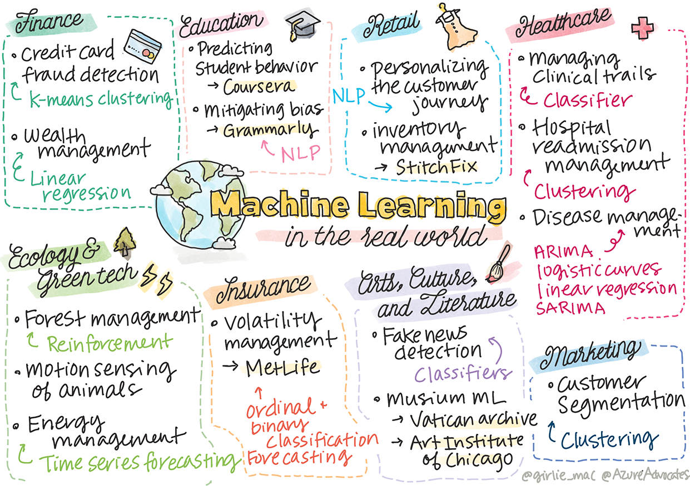

# 附言：机器学习的现实应用

> 速绘笔记作者：[Tomomi Imura](https://www.twitter.com/girlie_mac)

在本课程中，你已经学习了多种为训练准备数据和创建机器学习模型的方法。你构建了一系列经典的回归、聚类、分类、自然语言处理和时间序列模型。恭喜你！现在，你可能会想，这一切的意义何在…… 这些模型在现实世界中有哪些应用呢？

虽然人工智能（通常利用深度学习）在行业中引起了广泛关注，但经典机器学习模型仍然有其宝贵的应用场景。你甚至可能今天就在使用其中一些应用！在本课中，你将探索八个不同的行业和主题领域如何使用这些类型的模型，以使它们的应用程序对用户来说性能更优、更可靠、更智能且更有价值。

## [课前测验](https://gray-sand-07a10f403.1.azurestaticapps.net/quiz/49/)

## 💰 金融

金融行业为机器学习提供了许多机会。该领域的许多问题都可以通过使用机器学习来建模和解决。

### 信用卡欺诈检测

在课程的前半部分，我们学习了 [K-means 聚类](.../../5-Clustering/2-K-Means/README.md)，但它如何用于解决与信用卡欺诈相关的问题呢？

K均值聚类在一种名为**异常值检测**的信用卡欺诈检测技术中非常有用。离群值或一组数据观测值的偏差，可以告诉我们信用卡是在正常使用还是发生了异常情况。如下文链接的论文所示，您可以使用 K 均值聚类算法对信用卡数据进行分类，并根据每笔交易的异常程度将其归入一个群组。然后，你就可以评估欺诈交易和合法交易中风险最大的群组。
[参考资料](https://citeseerx.ist.psu.edu/viewdoc/download?doi=10.1.1.680.1195&rep=rep1&type=pdf)

### 财富管理

在财富管理中，个人或公司代表客户管理投资。他们的工作是长期维持和增长财富，因此选择表现良好的投资至关重要。

评估特定投资表现的一种方法是通过统计回归。[线性回归](.../../2-Regression/1-Tools/README.md)是了解某一基金相对于某个基准表现的有价值工具。我们还可以推断回归结果是否具有统计学意义，或者它们会对客户的投资产生多大影响。你甚至可以使用多元回归进一步扩大分析范围，将其他风险因素考虑在内。关于如何对特定基金进行此类分析的示例，请参阅以下关于使用回归法评估基金业绩的论文。
[参考资料](http://www.brightwoodventures.com/evaluating-fund-performance-using-regression/)

## 🎓 教育

教育领域也是一个非常有趣的可以应用机器学习的领域。有一些有趣的问题需要解决，比如检测考试或论文作弊，或者管理批改过程中有意或无意的偏差。

### 预测学生行为

在线公开课程提供商[Coursera](https://coursera.com/)有一个很棒的技术博客，他们在其中讨论了许多工程决策。在这个案例研究中，他们绘制了一条回归直线，试图探索低 NPS（净推荐值）评分与课程保留率或辍学率之间的任何相关性。
[参考资料](https://medium.com/coursera-engineering/controlled-regression-quantifying-the-impact-of-course-quality-on-learner-retention-31f956bd592a)

### 减少偏见

[Grammarly](https://grammarly.com)是一款检查拼写和语法错误的写作助手，在其产品中使用了复杂的[自然语言处理系统](.../.../6-NLP/README.md)。他们在自己的技术博客中发表了一个有趣的案例研究，讲述了他们如何处理机器学习中的性别偏见，你可以在我们的[公平性入门课程](..././1-Introduction/3-fairness/README.md)中了解到这一内容。
[参考资料](https://www.grammarly.com/blog/engineering/mitigating-gender-bias-in-autocorrect/)

## 👜 零售

零售行业肯定可以从机器学习的应用中受益，从打造更好的客户体验到优化库存管理等各个方面。

### 个性化客户体验

Wayfair 是一家销售家具等家居用品的公司，帮助客户找到符合他们品味和需求的产品至关重要。在这篇文章中，该公司的工程师描述了他们如何使用机器学习和自然语言处理来 “为客户呈现合适的搜索结果”。值得注意的是，他们的查询意图引擎已经构建完成，可以对客户评论进行实体提取、分类器训练、资产和观点提取以及情感标记。这是自然语言处理在在线零售中应用的一个经典案例。
[参考资料](https://www.aboutwayfair.com/tech-innovation/how-we-use-machine-learning-and-natural-language-processing-to-empower-search)

### 库存管理

像[StitchFix](https://stitchfix.com/)这样创新灵活的公司是一家为消费者寄送服装的订阅服务公司，它们严重依赖机器学习进行推荐和库存管理。实际上，他们的造型团队和商品采购团队是协同工作的：“我们的一位数据科学家对一种遗传算法进行了改进，并将其应用于服装领域，以预测那些目前尚未存在但可能会成功的服装款式。我们将其提供给商品采购团队，现在他们可以将其作为一种工具使用。”
[参考资料](https://www.zdnet.com/article/how-stitch-fix-uses-machine-learning-to-master-the-science-of-styling/)

## 🏥 医疗保健

医疗保健领域可以利用机器学习来优化研究任务，以及解决诸如患者再入院或阻止疾病传播等后勤问题。

### 管理临床试验

临床试验中的毒性是制药商的主要担忧。多大的毒性是可以接受的呢？在这项研究中，对各种临床试验方法的分析促成了一种新方法的开发，用于预测临床试验结果的可能性。具体来说，他们能够使用随机森林生成一个[分类器](./../4-Classification/README.md)，该分类器能够区分不同的药物组。
[参考资料](https://www.sciencedirect.com/science/article/pii/S2451945616302914)

### 再入院管理

医院护理成本高昂，尤其是当病人需要再次入院时。本文讨论了一家公司利用机器学习，使用[聚类](../../5-Clustering/README.md) 算法预测再入院的可能性。这些聚类有助于分析师 “发现可能有共同原因的再入院群体”。
[参考资料](https://healthmanagement.org/c/healthmanagement/issuearticle/hospital-readmissions-and-machine-learning)

### 疾病管理

最近的疫情凸显了机器学习在阻止疾病传播方面的作用。在这篇文章中，你会看到 ARIMA、逻辑曲线、线性回归和 SARIMA 等方法的应用。“这项工作旨在计算这种病毒的传播速度，从而预测死亡人数、康复人数和确诊病例数，以便帮助我们更好地做好准备并应对疫情。”
[参考资料](https://www.ncbi.nlm.nih.gov/pmc/articles/PMC7979218/)

## 🌲 生态与绿色科技

自然和生态系统包含许多敏感的子系统，其中动物与自然之间的相互作用是关注的焦点。准确测量这些系统并在出现问题（如森林火灾或动物种群数量下降）时采取适当行动非常重要。

### 森林管理

你在之前的课程中学习了[强化学习](.../../8-Reinforcement/README.md)。在尝试预测自然模式时，它非常有用。特别是，它可用于跟踪森林火灾和入侵物种传播等生态问题。在加拿大，一组研究人员使用强化学习从卫星图像构建森林野火动态模型。他们采用了一种创新的 “空间扩散过程（SSP）”，将森林火灾视为 “景观中任何一个单元格上的智能体”。“在任何时间点，火灾从某个位置可以采取的行动包括向北、向南、向东、向西扩散或不扩散。

这种方法颠覆了通常的强化学习设置，因为相应的马尔可夫决策过程（MDP）的动态是即时野火蔓延的已知函数。” 在下面的链接中可以了解该团队使用的经典算法的更多信息。
[参考资料](https://www.frontiersin.org/articles/10.3389/fict.2018.00006/full)

### 动物运动感应

虽然深度学习在视觉跟踪动物运动方面引发了一场革命（你可以在这里构建自己的[北极熊追踪器](https://docs.microsoft.com/learn/modules/build-ml-model-with-azure-stream-analytics/?WT.mc_id=academic-77952-leestott)），但经典机器学习在这项任务中仍然有其用武之地。

用于跟踪农场动物运动的传感器和物联网利用了这种类型的视觉处理，但更基础的机器学习技术对于预处理数据很有用。例如，在这篇论文中，使用各种分类器算法对绵羊的姿势进行了监测和分析。你可能会在第 335 页看到 ROC 曲线。
[参考资料](https://druckhaus-hofmann.de/gallery/31-wj-feb-2020.pdf)

### ⚡️ 能源管理

在我们的[时间序列预测](.../../7-TimeSeries/README.md)课程中，我们引入了智能停车收费表的概念，通过了解供需关系为城镇创收。这篇文章详细讨论了如何将聚类、回归和时间序列预测相结合，根据智能电表数据帮助预测爱尔兰未来的能源使用情况。
[参考资料](https://www-cdn.knime.com/sites/default/files/inline-images/knime_bigdata_energy_timeseries_whitepaper.pdf)

## 💼 保险

保险行业是另一个使用机器学习来构建和优化可行金融和精算模型的行业。

### 波动率管理

大都会人寿（MetLife）是一家人寿保险公司，它公开分享了他们分析和缓解金融模型中波动率的方法。在这篇文章中，你会看到二元和有序分类可视化。你还会发现预测可视化。
[参考资料](https://investments.metlife.com/content/dam/metlifecom/us/investments/insights/research-topics/macro-strategy/pdf/MetLifeInvestmentManagement_MachineLearnedRanking_070920.pdf)

## 🎨 艺术、文化与文学

在艺术领域，例如新闻业，有许多有趣的问题。检测假新闻是一个重大问题，因为事实证明它会影响人们的观点，甚至可能颠覆民主制度。博物馆也可以从机器学习的应用中受益，从发现文物之间的联系到资源规划等各个方面。

### 假新闻检测

在当今的媒体环境中，检测假新闻已经变成了一场猫捉老鼠的游戏。在这篇文章中，研究人员建议可以测试一个结合了我们所学的多种机器学习技术的系统，并部署最佳模型：“该系统基于自然语言处理从数据中提取特征，然后将这些特征用于训练机器学习分类器，如朴素贝叶斯、支持向量机（SVM）、随机森林（RF）、随机梯度下降（SGD）和逻辑回归（LR）。”
[参考资料](https://www.irjet.net/archives/V7/i6/IRJET-V7I6688.pdf)

这篇文章展示了如何将不同的机器学习领域相结合，从而产生有趣的结果，有助于阻止假新闻的传播和造成实际损害；在这个案例中，引发研究的原因是关于新冠治疗方法的谣言传播引发了暴力骚乱。

### 博物馆中的机器学习应用

博物馆正处于人工智能革命的前沿，随着技术的进步，文物编目、数字化收藏以及发现文物之间的联系变得更加容易。像[In Codice Ratio](https://www.sciencedirect.com/science/article/abs/pii/S0306457321001035#:~:text=1.,studies over large historical sources.)这样的项目正在帮助解开像梵蒂冈档案馆这样难以访问的收藏中的谜团。而且，博物馆的运营方面也受益于机器学习模型。

例如，芝加哥艺术学院建立了模型来预测观众对哪些展览感兴趣以及他们何时会参观展览。目标是每次用户参观博物馆时都能为他们创造个性化和优化的参观体验。芝加哥艺术学院高级副总裁安德鲁・西姆尼克（Andrew Simnick）说，“在 2017 财年，该模型对参观人数和门票销售的预测准确率达到了 1% 以内“。 
[参考资料](https://www.chicagobusiness.com/article/20180518/ISSUE01/180519840/art-institute-of-chicago-uses-data-to-make-exhibit-choices)

## 🏷 营销

### 客户细分

最有效的营销策略是根据不同的分组以不同的方式锁定客户。本文将讨论如何利用聚类算法来支持差异化营销。差异化营销有助于企业提高品牌知名度，接触更多客户，赚取更多利润。
[参考资料](https://ai.inqline.com/machine-learning-for-marketing-customer-segmentation/)

## 🚀 挑战

找出另一个从本课程中学到的某些技术中受益的行业，并了解它是如何使用机器学习的。

## [课后测验](https://gray-sand-07a10f403.1.azurestaticapps.net/quiz/50/)

## 复习与自学

Wayfair 数据科学团队有几个有趣的视频，介绍他们如何在公司使用 机器学习，[值得一看](https://www.youtube.com/channel/UCe2PjkQXqOuwkW1gw6Ameuw/videos)！

## 作业

[机器学习寻宝活动](assignment.md)