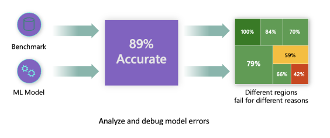
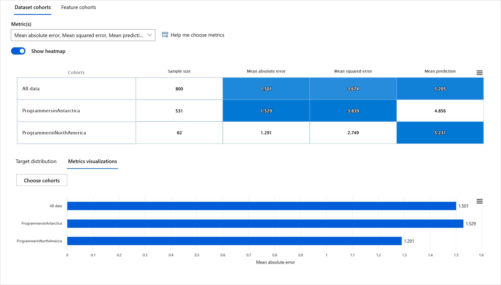
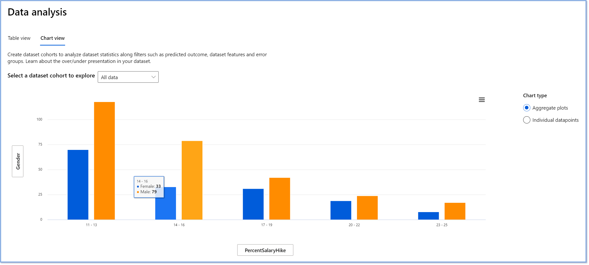
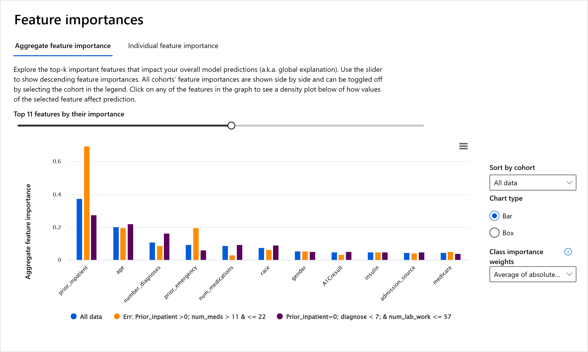
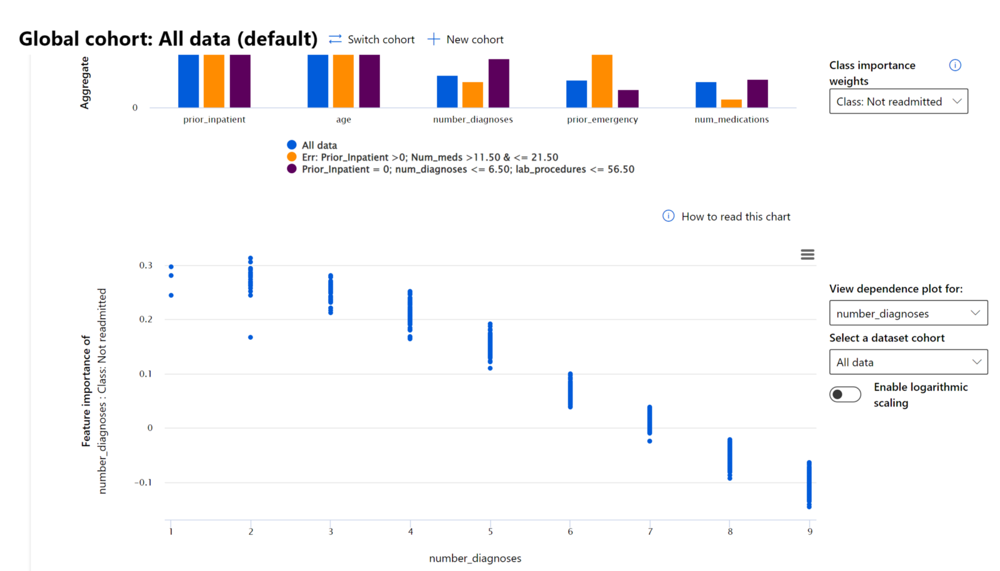

# 附录：使用RAI仪表板组件进行机器学习模型调试

## [课前测验](https://gray-sand-07a10f403.1.azurestaticapps.net/quiz/5/)

## 简介

机器学习正在影响我们的日常生活。人工智能正在渗透到影响我们个人和社会的一些最重要的系统中，包括医疗保健、金融、教育和就业等领域。例如，系统和模型参与日常决策任务，如医疗保健诊断或欺诈检测。因此，人工智能的进步以及加速采用正在遇到不断发展的社会期望和日益增长的监管回应。我们不断看到人工智能系统继续未能满足期望的领域，它们暴露出新的挑战，政府也开始监管人工智能解决方案。因此，必须对这些模式进行分析，以便为每个人提供公平、可靠、包容、透明和负责任的结果。

在本课程中，我们将探讨可用于评估模型是否存在RAI问题的实用工具。传统的机器学习调试技术往往基于定量计算，如汇总准确率或平均错误损失。想象一下，当您用于构建这些模型的数据缺乏某些人口统计学特征（如种族、性别、政治观点、宗教等）或不成比例地代表这些人口统计学特征时会发生什么。当模型的输出被解释为偏向某些人口统计学特征时又会如何？这可能导致这些敏感特征群体的过度或不足代表，从而导致模型的公平性、包容性或可靠性问题。另一个因素是，机器学习模型被认为是黑盒，这使得难以理解和解释驱动模型预测的因素。当数据科学家和人工智能开发人员没有足够的工具来调试和评估模型的公平性或可信度时，所有这些都是他们面临的挑战。

在本课程中，您将学习使用以下工具调试模型：

- **错误分析**：识别数据分布中模型具有高错误率的区域。
- **模型概述**：跨不同数据队列执行比较分析，发现模型性能指标的差异。
- **数据分析**：调查数据可能存在过度或不足代表的位置，从而使模型偏向于某一数据群体与另一数据群体。
- **特征重要性**：了解在全局或局部层面上驱动模型预测的特征。

## 先决条件

作为先决条件，请查阅[面向开发人员的RAI工具](https://www.microsoft.com/ai/ai-lab-responsible-ai-dashboard)

## 错误分析

用于测量准确性的传统模型性能指标主要是基于正确与错误预测的计算。例如，如果一个模型的准确率为 89%，误差损失为 0.001，可以被认为是良好的性能。然而，错误通常在基础数据集中分布不均匀。您可能获得89%的模型准确率分数，但发现模型在某些数据区域42%的时间内失败。这些特定数据组的失败模式可能导致公平性或可靠性问题。理解模型表现良好或不良的区域至关重要。模型中存在大量不准确性的数据区域可能成为重要的数据人口统计学特征。

RAI仪表板上的错误分析组件通过树形可视化展示了模型失败如何在各个队列中分布。这有助于识别数据集中错误率高的特征或区域。通过查看大部分模型不准确性的来源，您可以开始调查根本原因。您还可以创建数据队列来执行分析。这些数据队列有助于调试过程，确定为什么模型在一个队列中性能良好，但在另一个队列中出现错误。

树形图上的视觉指示器有助于更快地定位问题区域。例如，树节点的红色阴影越深，错误率越高。

热图是用户在使用一个或两个特征调查错误率时可以使用的另一种可视化功能，用于发现整个数据集或队列中模型错误的贡献者。

在以下情况下使用错误分析：

* 深入了解模型失败如何在数据集和多个输入和特征维度上分布。
* 分解汇总性能指标，自动发现错误队列，为您的有针对性的缓解步骤提供信息。

## 模型概述

评估机器学习模型的性能需要全面了解其行为。这可以通过审查多个指标来实现，如错误率、准确性、召回率、精确度或MAE（平均绝对误差），以发现性能指标之间的差异。一个性能指标可能看起来很好，但不准确性可能在另一个指标中暴露出来。此外，比较整个数据集或队列中指标的差异有助于揭示模型表现良好或不良的区域。这在查看模型在敏感与非敏感特征（如患者种族、性别或年龄）中的性能时特别重要，以揭示模型可能存在的潜在不公平性。例如，发现模型在具有敏感特征的队列中更容易出错，可能揭示模型可能存在的潜在不公平性。

RAI仪表板的模型概述组件不仅有助于分析队列中数据表示的性能指标，还使用户能够比较不同队列中模型的行为。

该组件的基于特征的分析功能允许用户缩小特定特征内的数据子组，以在细粒度级别上识别异常。例如，仪表板具有内置智能，可以自动为用户选择的特征生成队列（如*“住院时间<3”*或*“住院时间>=7”*）。这使用户能够从较大的数据组中分离出特定特征，以查看它是否是模型错误结果的主要影响因素。

模型概述组件支持两类差异指标：

**模型性能差异**：这些指标计算所选性能指标在数据子组间的差异（差值）。以下是一些示例：

* 准确率差异
* 错误率差异
* 精确度差异
* 召回率差异
* 平均绝对误差（MAE）差异

**选择率差异**：此指标包含子组间选择率（有利预测）的差异。贷款批准率的差异就是一个例子。选择率是指每个类别中被分类为1的数据点的比例（在二元分类中）或预测值的分布（在回归中）。

## 数据分析

> "如果你折磨数据的时间足够长，它就会承认任何事情" - 罗纳德-科斯

这个说法听起来极端，但数据确实可以被操纵来支持任何结论。这种操纵有时可能无意中发生。作为人类，我们都有偏见，通常很难有意识地知道何时在数据中引入偏见。在AI和机器学习中保证公平性仍然是一个复杂的挑战。

数据是传统模型性能指标的一个巨大盲点。您可能有高准确率分数，但这并不总是反映数据集中可能存在的潜在数据偏见。例如，如果一个员工数据集中，公司高管职位的女性比例为 27%，而同一级别的男性比例为 73%，那么根据该数据训练的招聘广告人工智能模型可能会将大部分男性受众作为高级职位的目标受众。数据的这种不平衡使模型的预测偏向于某一性别。这揭示了AI模型中存在性别偏见的公平性问题。

RAI仪表板上的数据分析组件有助于识别数据集中过度和不足代表的区域。它可帮助用户诊断因数据不平衡或特定数据组缺乏代表性而导致的错误和公平性问题的根本原因。这样，用户就能根据预测结果和实际结果、错误群组和特定特征对数据集进行可视化。有时，发现代表性不足的数据组还能发现模型学习效果不佳，因此误差较大。模型存在数据偏差不仅仅是一个公平性问题，还表明模型不具有包容性或可靠性。

在以下情况下使用数据分析：

* 通过选择不同的过滤器将数据切分为不同维度（也称为队列）来探索数据集统计信息。
* 了解数据集在不同队列和特征组中的分布。
* 确定与公平性、误差分析和因果关系（从仪表盘其他组件中得出）相关的发现是否是数据集分布的结果。
* 决定在哪些方面收集更多数据，以减少因代表性问题、标签噪声、特征噪声、标签偏差及类似因素造成的误差。

## 模型可解释性

机器学习模型往往是黑盒。理解哪些关键数据特征驱动模型预测可能具有挑战性。为模型做出特定预测的原因提供透明度是重要的。例如，如果AI系统预测糖尿病患者有在30天内重新入院的风险，那么它应该能够提供导致其预测的辅助数据。辅助数据指标具有透明度，有助于临床医生或医院在充分知情的情况下做出决策。此外，能够解释模型为什么会对个别患者做出预测，也有助于遵守卫生法规。当您使用机器学习模型影响人们的生活时，了解并解释影响模型行为的因素至关重要。模型的可解释性和可解释性有助于回答以下场景中的问题：

* 模型调试：为什么我的模型会犯这个错误？我如何改进我的模型？
* 人机协作：如何理解和信任模型的决策？
* 监管合规：我的模型是否满足法律要求？

RAI仪表板的特征重要性组件帮助您调试并全面了解模型如何做出预测。对于机器学习专业人员和决策者来说，这也是一个有用的工具，可以解释和显示影响模型行为的特征证据以实现监管合规。接下来，用户可以探索全局和局部解释，验证哪些特征驱动模型预测。全局解释列出了影响模型整体预测的顶部特征。局部解释显示哪些特征导致模型对个别案例的预测。评估局部解释的能力也有助于调试或审核特定案例，从而更好地理解和解释模型预测准确或不准确的原因。

* 全局解释：例如，哪些特征影响糖尿病医院再入院模型的整体行为？
* 局部解释：例如，为什么一个60岁以上有既往住院史的糖尿病患者被预测为在30天内重新入院或不重新入院？

在检查模型在不同队列中性能的调试过程中，特征重要性显示了特征在各队列中的影响程度。它有助于在比较特征在驱动模型错误预测中的影响程度时揭示异常。特征重要性组件可以显示特征中的哪些值对模型结果产生积极或消极影响。例如，如果模型做出不准确预测，该组件使您能够深入分析并确定哪些特征或特征值驱动了预测。这种详细程度不仅有助于调试，还在审计情况下提供透明度和问责制。最后，该组件可以帮助您识别公平性问题。例如，如果种族或性别等敏感特征在驱动模型预测中具有高度影响力，这可能是模型中存在种族或性别偏见的迹象。

在以下情况下使用可解释性：

* 通过了解哪些特征对预测最重要来确定AI系统预测的可信度。
* 通过首先理解模型并识别模型是否使用健康特征或仅仅是虚假相关性来进行模型调试。
* 通过了解模型是否基于敏感特征或与之高度相关的特征进行预测来揭示潜在的不公平来源。
* 通过生成局部解释来说明结果，建立用户对模型决策的信任。
* 完成AI系统的监管审计，验证模型并监控模型决策对人类的影响。

## 结论

所有RAI仪表板组件都是实用工具，帮助您构建对社会危害较小且更值得信赖的机器学习模型。它改善了对人权威胁的预防，防止歧视或排斥某些群体的生活机会，以及身体或心理伤害的风险。它还通过生成局部解释来说明结果，帮助建立对模型决策的信任。一些潜在危害可以分类为：

- **分配**，如果某一性别或种族比另一性别或种族更受青睐。
- **服务质量**。如果您为一个特定场景训练数据，但现实要复杂得多，就会导致服务质量低下。
- **刻板印象**。将给定群体与预先分配的属性相关联。
- **诋毁**。对某事或某人进行不公正的批评和贴标签。
- **代表性过高或过低**。某一群体在某一行业中没有被看到，任何继续促进这种情况的服务或功能都在助长伤害。

### Azure RAI 仪表板

[Azure RAI 仪表板](https://learn.microsoft.com/en-us/azure/machine-learning/concept-responsible-ai-dashboard?WT.mc_id=aiml-90525-ruyakubu)建立在领先学术机构和包括微软在内的组织开发的开源工具基础上，对数据科学家和AI开发人员更好地理解模型行为、发现和缓解AI模型的不良问题具有重要意义。

- 通过查看RAI仪表板[文档](https://learn.microsoft.com/en-us/azure/machine-learning/how-to-responsible-ai-dashboard?WT.mc_id=aiml-90525-ruyakubu)了解如何使用不同组件。
- 查看一些RAI仪表板[示例笔记本](https://github.com/Azure/RAI-vNext-Preview/tree/main/examples/notebooks)，以在Azure机器学习中调试更多RAI场景。

---

## 🚀 挑战

为了从一开始就防止统计或数据偏见的引入，我们应该：

- 系统工作人员的背景和观点要多样化
- 投资于反映社会多样性的数据集
- 开发更好的方法来检测和纠正偏见

思考现实生活中模型构建和使用中存在不公平性的场景。我们还应该考虑什么？

## [课后测验](https://gray-sand-07a10f403.1.azurestaticapps.net/quiz/6/)

## 复习与自学

在本课程中，您已经了解了将负责任的人工智能融入机器学习的一些实用工具。

观看此研讨会以深入了解主题：

- RAI仪表板： Besmira Nushi 和 Mehrnoosh Sameki 在实践中操作 RAI 的一站式商店

> 🎥 点击上面的图片观看视频：负责任的人工智能仪表板： Besmira Nushi 和 Mehrnoosh Sameki 在实践中操作 RAI 的一站式商店

参考以下材料了解更多关于RAI以及如何构建更值得信赖的模型：

- 微软用于调试机器学习模型的RAI仪表板工具：[RAI工具资源](https://aka.ms/rai-dashboard)
- 探索RAI工具包：[Github](https://github.com/microsoft/responsible-ai-toolbox)
- 微软的RAI资源中心：[RAI资源 – 微软AI](https://www.microsoft.com/ai/responsible-ai-resources?activetab=pivot1%3aprimaryr4)
- 微软的FATE研究小组：[FATE：人工智能中的公平、问责、透明和道德 - 微软研究院](https://www.microsoft.com/research/theme/fate/)

## 作业

[探索RAI仪表板](assignment.md)